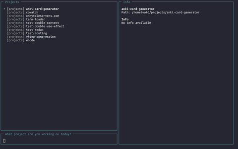

# wcode - Unf*ck your project folder

> For side-project collectors of all ages and genders.
wcode (which code) provides a simple way to find and navigate to the correct project directory.

## Features
✅ Fullscreen TUI display \
✅ Searching with Linear Search (fallback) \
✅ Searching with RipGrep \
✅ Project details view \
🟥 Config to make things beautiful



## 🌱 How to install
1. Clone the repo.
2. Set variable WCODE_PATHS with all the paths (space separated) the tool will look for projects
3. Profit?!?

## 🌷 How to use
To use it after compilation run the following command
```sh
bin/wcode; if [ $(echo $?) -eq 0 ]; then cd $(cat ~/.config/wcode/selection); else echo "No project selected"; fi
```
and alias it... don't be silly.

## 🧑‍🌾 How to contribute
Feel free to suggest any additions or changes by opening a pull request || an issue.
